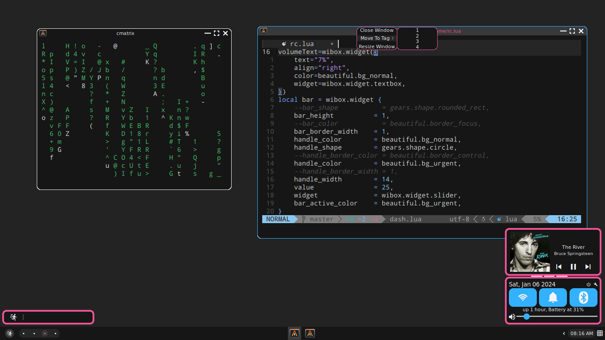

# Sprint Speed: Low Quality Dotfiles

### Installing
⚠️ Warning⚠️ 
These dot files in their default configuration will delete your custom alacritty theme if you have one and replace it with a themed version. The solution to this is to turn off the Alacritty theme switcher in [settings.lua](./settings.lua).

###### Clone the repo using `git clone --recursive https://github.com/slicetext/awm_dots.git ~/.config/awesome`. Replace the `~/.config/awesome` with something else if you're a NixOS nerd.

### Dependencies (I may have forgotten a couple)
###### -A nerd font
###### -Sans font
###### -[Playerctl](https://github.com/altdesktop/playerctl)
###### -AwesomeWM Git Version
###### -ansiweather
###### -Picom (Optional)*
###### \*I recommend Picom Allusive with [this](./extra/picom.conf) config

### Keybinds
###### Super+/: See all Keybinds

### Customization
###### All user settings are in the settings.lua file

### Theming
###### This is a theme file for the paper colorscheme
```
file={} --Defines the theme
file.bg_normal     = "#f2eede" --color of background
file.bg_minimize   = "#bfbcaf" --color of various parts of the bar
file.bg_urgent     = "#cc3e28" --color of control panel toggles and urgent notifications
file.bg_focus      = "#d8d5c7" --color of various parts of the bar
file.bg_systray    = file.bg_normal --color of the systray
file.fg_normal     = "#000000" --fg color
file.fg_focus      = "#000000" --fg color
file.fg_urgent     = "#000000" --fg color
file.fg_minimize   = "#000000" --fg color
file.border_normal = "#000000" --fg color
file.border_focus  = "#5c21a5" --window border color
file.border_marked = "#5c21a5" --window border color
file.border_control= "#1e6fcc" --popup border color
file.wallpaper     = "~/.config/awesome/bg/paper.png" --wallpaper location
file.button_outline= 1 --if 1, the toggle buttons have an outline. If 0, they do not
file.light         = false --If the theme is a light theme or not
return file --return the theme

```
###### Put themes in the themes directory as [themename].lua. For example, paper's is paper.lua. Set the theme in settings.lua by making settings.theme equal to the name of your theme. For example, for paper make it `settings.theme="paper"`.

#### Alacritty Theme Switcher
###### If you have this enabled, you can make an Alacritty theme to go with your color theme.
###### First, edit alacritty.lua. It should have a line that is something like `local alacritty_theme_list={"biscuit","oxocarbon"}` Add the name of your theme to this list. Next, make a file in the alacritty\_themes folder called [your\_theme\_name].yml that has your Alacritty theme inside of it. Then, you're done!

### Credits
##### Wallpapers from:
###### -https://github.com/bl4ck44/Wallpapers
###### -https://github.com/linuxdotexe/nordic-wallpapers
###### -https://github.com/awesomeWM/awesome
##### Libraries:
###### Rubato
